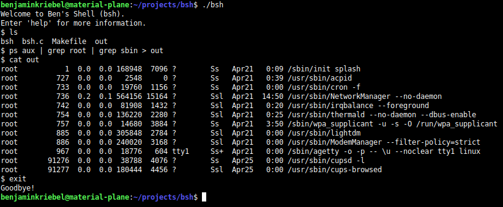

# bsh
A UNIX-like shell written in C.

  

## Features
This shell can execute basic shell commands like `ls`, `grep`, etc. Other features include:
- I/O redirection
- Pipelining
- Zombie process elimination

## Built-In Commands
| Command  | Description |
|----------|-------------|
| cd       | change the current working directory |
| printenv | print the user environment           |
| setenv   | set an environment variable          |
| unsetenv | remove an environment variable       |
| exit     | close the shell                      |
| help     | display useful information about bsh |

## Usage
To run the shell, built it by running `make` and the execute it by running `./bsh`.
To clean the shell, run `make clean`.

## Future Features
- Wildcarding
- Tab completion
- Command history
